# VEKTON | Physics Illustrator (v1.01)

> [!TIP]
> **[繁體中文版 (Traditional Chinese)](README.zh-TW.md)**

A specialized vector drawing tool designed for physics education and handout creation.
VEKTON offers a smooth interactive experience and exports high-quality SVG and PNG images, helping users easily create professional physics diagrams.

---

## 👨‍💻 Developer Information

**Contact Email**: <hsiehchihhsun001@gmail.com>

> [!NOTE]
> **Donation Link**: (Coming Soon...)
> If you find this software helpful, donations to support future development are welcome!

---

## 🌐 Online Demo

Try it instantly in your browser without installation:
👉 **[Launch Online Version (Vercel)](https://physics-illustrator.vercel.app/)**

---

## �️ Example Outputs

<p align="center">
  
  
  
</p>

---

## �🚀 Key Features

VEKTON aims to solve the difficulty of quickly drawing physics components in traditional vector software. Core features include:

1. **Professional Physics Component Library**
    - Built-in common physical models: Spring, Pulley, Block, Catenary/Rope, Wall, etc.
    - Circuit components: Resistor, Capacitor, Inductor, Power Source (AC/DC), Switch, etc.
    - Vector tools: Supports automatic snapping, component visualization, and arrow style customization.

2. **Highly Customizable Properties**
    - All objects have adjustable properties, including color, line width, size, and rotation.
    - Supports Text and Math Symbols (LaTeX) for labeling physical quantities (e.g., $\theta, \vec{F}, \Delta x$).
    - Offers multiple font choices (Inter, STIX Two Text) to meet academic publishing needs.

3. **Precise Control & Interaction**
    - **Snapping**: Easily align objects to the grid and other components.
    - **Angle Display**: Real-time angle readout for precise geometric adjustments.
    - **Drag & Drop**: Intuitive manipulation and multi-object selection.

4. **High-Quality Export**
    - **PNG Export**: High-resolution images suitable for presentations and web.
    - **SVG Export**: Vector format suitable for printing and advanced editing.
    - **Auto-Crop**: Automatically crops the canvas to preserve only the drawn content.

---

## 💻 Installation & Usage (Windows)

If you wish to use VEKTON **offline** or without an internet connection, please follow these steps:

### Step 0: Download the Project

If you are not familiar with Git commands, you can download the project as a ZIP file:

1. On the GitHub page, click the green **"<> Code"** button.
2. Select **"Download ZIP"**.
3. **Extract (Unzip)** the downloaded file to a folder on your computer (e.g., Desktop).

### Step 1: Install Environment (Node.js)

1. Visit the [Node.js Official Website](https://nodejs.org/).
2. Download and install the **"LTS" (Long Term Support)** version.
3. Click "Next" through the installer until finished.

### Step 2: Run the Application

Navigate to the folder where you extracted or cloned the project.

1. Click the address bar at the top of the folder window, type `cmd`, and press **Enter** to open a terminal/command prompt.
2. **First time setup**: Copy and paste the following commands (Right-click to paste):

    **Command 1: Install Dependencies (Run once only)**

    ```bash
    npm install
    ```

    *(Wait for the progress bar to finish until you see text like `added ... packages`)*

    **Command 2: Start the App**

    ```bash
    npm run dev
    ```

3. When the terminal shows `Local: http://localhost:5173/`, hold **Ctrl** and click the link to open the application in your browser.

---

### FAQ

- **Q: Do I need to run commands every time?**
  - A: Yes. You need to repeat **Step 2** (open terminal and run `npm run dev`) each time. You do *not* need to run `npm install` again. Alternatively, you can double-click `start_app.bat` if available.
- **Q: The screen is white or unresponsive?**
  - A: Please make sure the terminal window is **NOT closed**. The terminal must remain open for the software to run.

---

© 2026 Physics Illustrator Project. All rights reserved.
